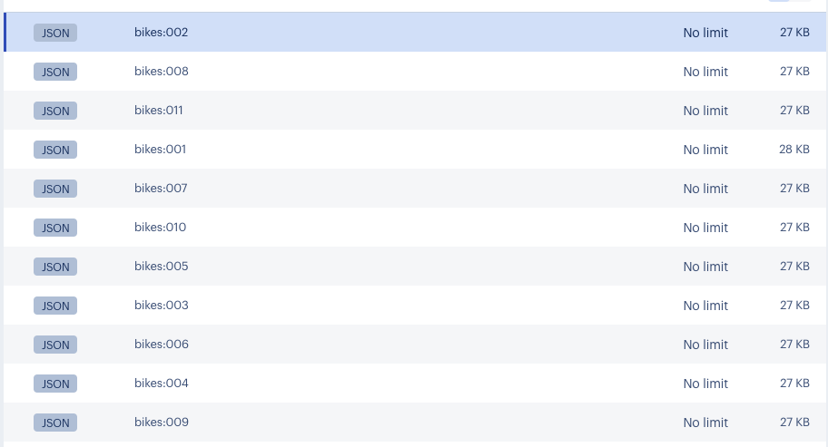

The code inserts bike data into Redis as JSON objects (one object per bike) using keys like bikes:001, bikes:002, etc.

we can fetch/read this data in Python with:

# Get a single bike document by key
bike = client.json().get("bikes:001")
print(json.dumps(bike, indent=2))

Each bike object might look like:

json
{
  "model": "Summit",
  "brand": "nHill",
  "price": 1200,
  "type": "Mountain Bike",
  "specs": {
    "material": "alloy",
    "weight": "11.3"
  },
  "description": "This budget mountain bike from nHill performs well...",
  "description_embeddings": [ -0.41, 0.52, ..., 0.07 ]  // 768 floats
}

Key fields:

Basic attributes: model, brand, price, type, specs, description.

description_embeddings: This is the vector embedding (see below).

2. What is a Vector Embedding?

In machine learning/natural language processing (NLP), a "vector embedding" is an array of floating-point numbers (e.g., [0.23, -0.15, ...]) that represents the meaning of text (here, the bike’s description).

Embeddings are created by machine learning models (the code uses SentenceTransformer with a specific model).

They “encode” the semantics of the description so similar descriptions get similar vectors.

3. What is “dimension” in this context?

Dimension means the length of the vector array.

In our code, VECTOR_DIMENSION = 768 = so each embedding is an array with 768 floats.

Higher dimensions typically capture richer representations of meaning.

4. Other Vector Concepts in the Data

Because all bike data is embedded with the same model, all vectors are the same dimension (768), directly comparable (euclidean/cosine distance means true semantic similarity).

Vectors are stored as an extra field in each bike’s JSON in Redis.

# How Vectors Work for This Dataset

Each bike’s description is mapped to a 768-dimension vector.

When we ask a semantic query (in English), it's transformed into a similar 768-float vector.

The database computes distances between the query and each stored description; the smallest distance means the closest match in meaning.

This makes search smart and “human-like”— we get bikes for “tall riders” even if the description never uses the words “tall rider” but mentions “XXL frame”.

# Summary 

Query Type	Uses Vectors?	Use Case in Bike Dataset
KNN	        Yes	            “Find me bikes most similar to my requirements, in plain English.”
Hybrid	    Yes + Filter	“Find best matches, but only among a certain brand/price/type.”
Range	    Yes	            “Find all bikes that are similar enough to my query, not just the best.”
Attribute	No	            “Find all bikes matching this brand/type/price.”

# Breakdown of example 1 Basic KNN vector search query

1. Text Query is Transformed Into a Vector

We use a SentenceTransformer model (like msmarco-distilbert-base-v4) to convert our natural language query into a numerical embedding (vector).

# python
from sentence_transformers import SentenceTransformer

embedder = SentenceTransformer("msmarco-distilbert-base-v4")
query_text = "Best mountain bikes for kids"
query_vector = embedder.encode([query_text])[0]  # Outputs a numpy array of length 768
print(query_vector[:10])  # Print the first 10 floats to illustrate

# What’s happening?

The model processes your input text and generates a list of 768 floating point numbers (the embedding), e.g.:

[-0.041, 0.102, 0.230, ..., 0.174]

This number sequence represents the semantic "meaning" of your input phrase in a mathematical space.

2. Redis Stores Embeddings for All Bikes

Each bike’s description was pre-encoded (during dataset setup) with the same model, producing a similar 768-dimensional embedding, and stored as description_embeddings in the bike’s JSON document in Redis.

3. KNN Query in Redis

Redis’s vector search is powered by the RediSearch module. You can issue a KNN search query that looks like:
//
from redis.commands.search.query import Query
import numpy as np

# Build the KNN query; this asks for the top 3 most similar bikes
knn_query = (
    Query("(*)=>[KNN 3 @vector $query_vector AS vector_score]")
    .sort_by("vector_score")
    .return_fields("vector_score", "id", "brand", "model", "description")
    .dialect(2)
)

# Run the query by sending the query vector as a byte array
results = client.ft("idx:bikes_vss").search(
    knn_query,
    query_params={"query_vector": np.array(query_vector, dtype=np.float32).tobytes()}
)
//

>> Redis will:

a. Receive your query vector.

b. For every bike’s stored description_embeddings vector, compute the cosine distance (or similarity) to your query vector.

c. Return the top 3 bikes with the smallest distance (that is, most “semantically similar”).

4. Sample Output from Redis

You’ll get a list of result objects, each representing a bike:

//
for doc in results.docs:
    print(f"Brand: {doc.brand}, Model: {doc.model}, Score: {1 - float(doc.vector_score):.3f}")
    print(f"Description: {doc.description}\n")
//

where, 

vector_score is the distance (where smaller = more similar for cosine).

By using 1 - vector_score, you turn distance into "similarity" (higher = better match).

# Summary Table: What’s Happening at Each Step

Step	                                        Action
User enters query (“Best mountain bikes...”)	Embedding model converts it to a 768-float vector
Each bike in Redis	                            Already has a stored embedding for its description
Redis receives query & bytes-encoded vector	    Compares it to all bike embeddings using cosine distance
Top K matches returned	                        Bikes whose descriptions are “closest in meaning” to the user’s query

# This process enables “semantic” search. we’re finding bikes about mountain biking for kids, even if the words “best” or “kids” are not exactly present in their descriptions! This makes the search much smarter and more relevant than keyword matching.

# Refer the workflow diagram

# FAQs

Q1. Whats the logic behind 768 why the vector embedding in redis and query conversion to float both are 768.

The number 768 refers to the dimension of the vector embeddings produced by the specific machine learning model used—in this case, the SentenceTransformer model msmarco-distilbert-base-v4. https://huggingface.co/sentence-transformers/msmarco-distilbert-base-v4 

Q2. Why 768 Dimensions?

The embedding dimension is a fixed property of the neural network architecture used in the model.

768 dimensions means that every piece of text (a bike description or a query) is converted into a point in a 768 dimensional vector space.

This dimensionality balances expressive power and computational efficiency:

Imp: Higher dimensions can encode richer semantic information.
     Lower dimensions would lose details and reduce accuracy.

The model we use was pretrained to output embeddings of length 768, so all embeddings it produces whether for Redis data or user queries are exactly length 768.

Q3. Why The Same Dimension For Redis and Queries?

Consistency: Redis vector search requires all vectors to have the same dimensions for meaningful similarity comparison.

Similarity metrics (like cosine distance) are defined between vectors of equal length.

So:

You convert all bike descriptions to embeddings of length 768 and store them.

You convert the user query also into a 768-dimensional embedding before searching.

<< IMP >> This ensures valid, fair distance computations and rankings.

Q4. Can there be a scenario where the query has dimensions more than the data dimensions stored in Redis.

In general, no, the query embedding dimension cannot be different from the stored data embedding dimension when performing vector search in Redis or similar vector databases.

<<Why Query and Data Embeddings Must Have the Same Dimension

1. Mathematical Validity of Distance Metrics:

Similarity and distance functions (cosine similarity, Euclidean distance, etc.) require vectors to be of the same dimension to compute valid results.

Calculating distance between vectors of different sizes is undefined mathematically.

2. System and Index Constraints:

Redis vector indexes are created with a fixed dimension specified (e.g., 768).

All vectors inserted into Redis must match this dimension.

Query vectors passed to the KNN search must also match this dimension, or Redis will raise an error.

3. Embedding Model Consistency:

Usually, the same embedding model is used for both storing data vectors and encoding queries.

Model architectures produce a fixed-size vector output determined at training time.

<<What if Dimensions Differ?

If the query vector has more dimensions than stored vectors:

    Redis (and most vector search engines) will reject the query with an error.

If the query vector has fewer dimensions:

    Similarly, it’s invalid and won’t work.

Partial truncation or padding:

    There are no automatic mechanisms; you must ensure vectors are consistent before indexing/searching.

Scenario Exceptions

If you use different embedding models for data and queries with different output dimensions, you must:

    Re-embed all data with the new model to match query dimension.

    Or consistently enforce a dimension reduction or extension step before indexing and querying.

But such mismatches are not supported directly by Redis because distance calculations become invalid.

# Summary

Scenario	                            Allowed?	Reason
Query dim = Data dim (e.g., both 768)	Yes	        Valid vector distance
Query dim ≠ Data dim	                No	        Distance computation invalid; raised error in Redis and other vector engines
